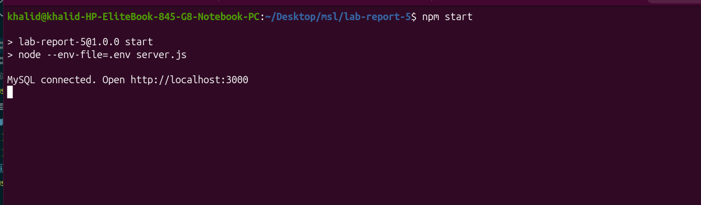
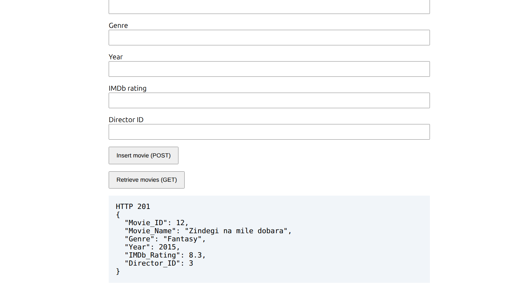

# Lab 5 — Express.js and MySQL REST API

An Express.js API that retrieves data and inserts movies into the supplied `movie_info` MySQL database. Uses the `mysql2` driver and parameterized SQL queries. Laragon is optional.

## Run

Requires Node.js 22+ and a running MySQL server.

```bash
npm install
cp .env.example .env
sudo mysql < database.sql
sudo mysql
```

Import `database.sql` once. In the MySQL prompt, create the application account:

```sql
CREATE USER 'lab_user'@'localhost' IDENTIFIED BY 'change_this_password';
GRANT SELECT, INSERT ON movie_info.* TO 'lab_user'@'localhost';
EXIT;
```

Update `.env` with your MySQL credentials, then run `npm start` and open **http://localhost:3000**. Keep `.env` private.

## API

| Method | Route | Purpose |
| --- | --- | --- |
| GET | `/api/movies` | Retrieve movies |
| GET | `/api/directors` | Retrieve directors |
| GET | `/api/actors` | Retrieve actors |
| GET | `/api/characters` | Retrieve characters |
| GET | `/api/movie-characters` | Retrieve relationships |
| POST | `/api/movies` | Insert a movie |

Use the browser form to insert a movie with an unused ID and an existing director ID, then click **Retrieve movies (GET)** to check the saved record. Run `npm test` for the automated API check, which uses a simulated database.

## Screenshots

Successful server startup and MySQL connection:



Successful movie insertion in the browser (HTTP 201):



## Submission

Submit the [GitHub repository](https://github.com/km-wahid/Developing-a-REST-API-Server-Using-Express.js-and-MySQL-) in Google Classroom and comment your roll number. The report is in [LAB_REPORT.md](LAB_REPORT.md).
